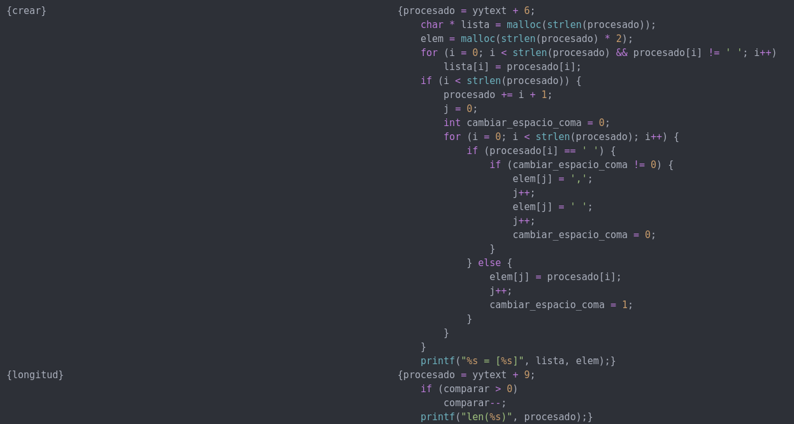
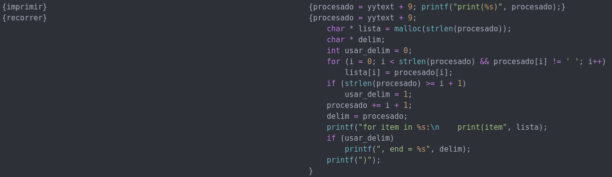
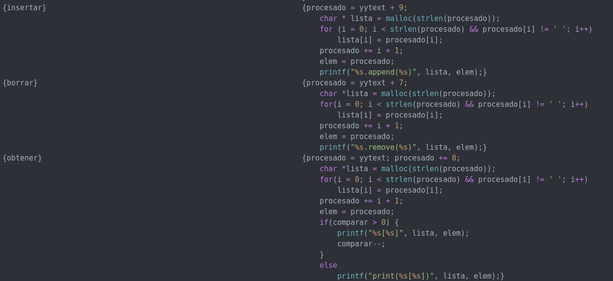
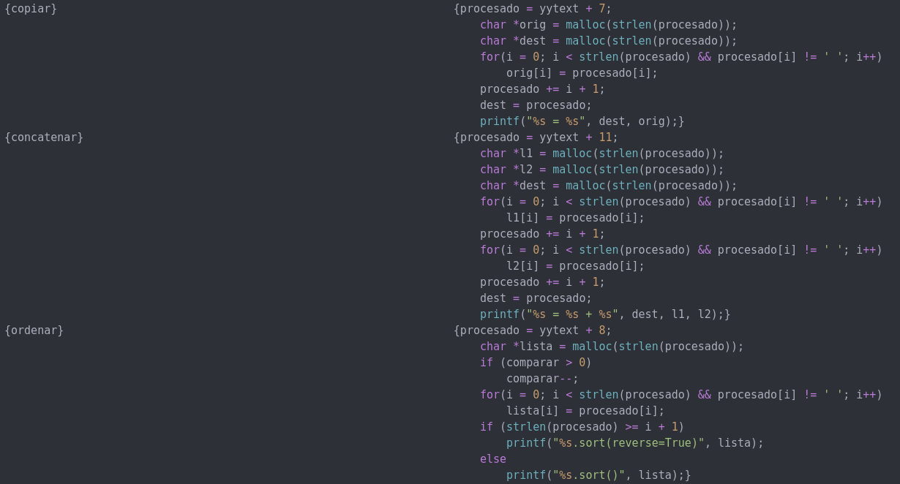
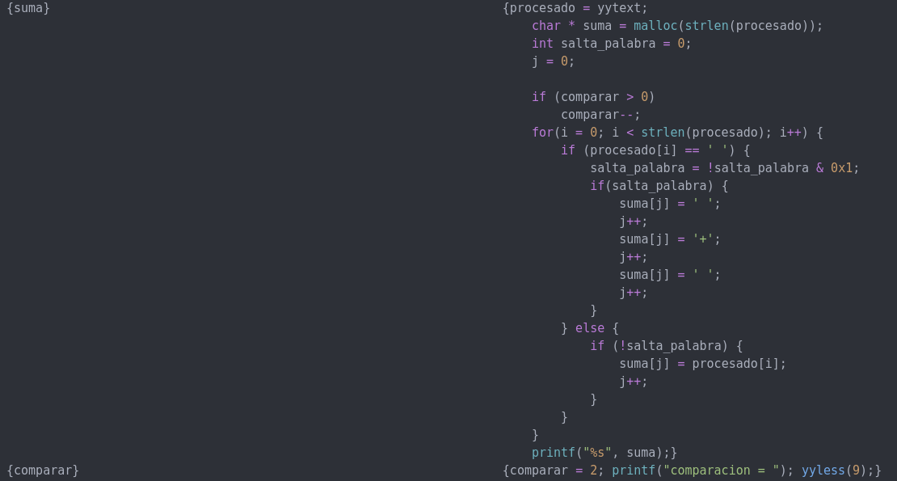
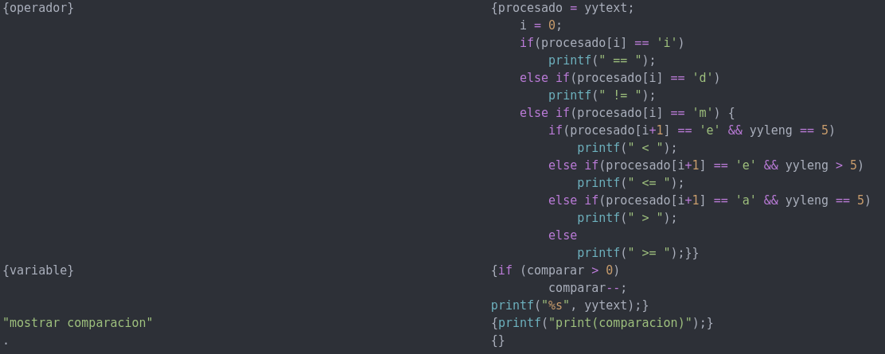
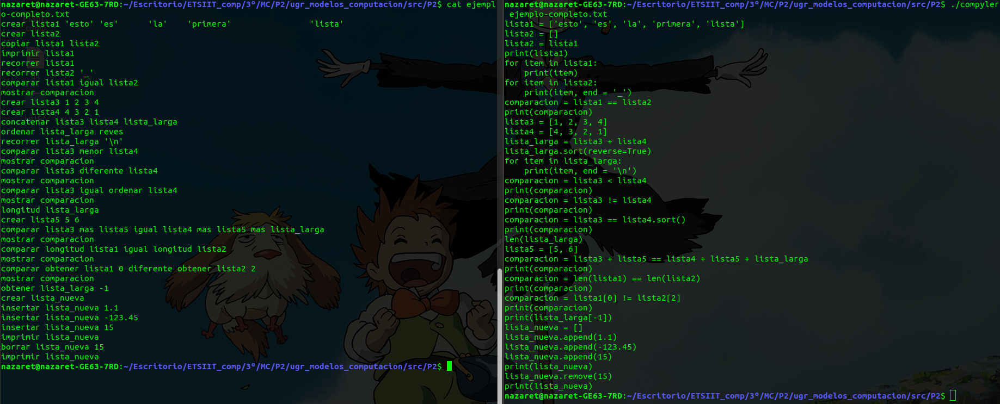

# Variables y alias
\begin{center}
	\includegraphics[width=0.7\textwidth]{variables-alias.png}
\end{center}

# Funcionalidades (I)

# Funcionalidades (II)

# Funcionalidades (III)

# Funcionalidades (IV)

# Funcionalidades (V)

# Funcionalidades (VI)

# Ejemplo: salida por defecto

# Ejemplo: salida a un archivo .py

